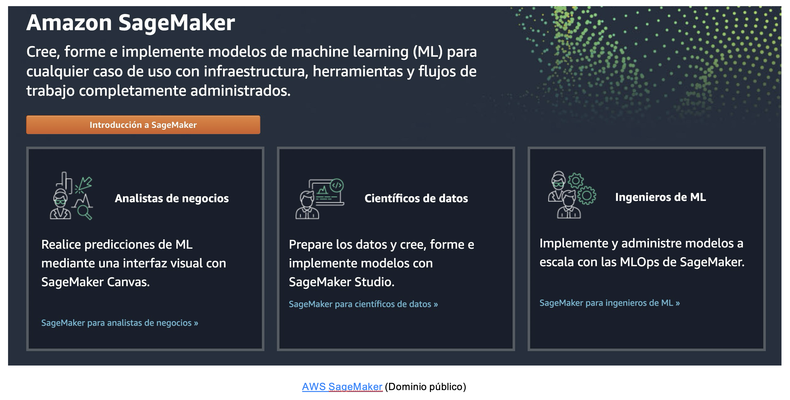
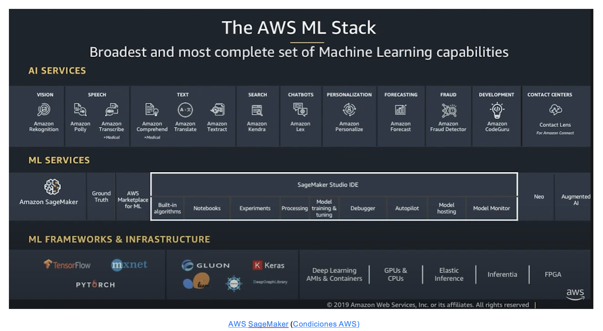
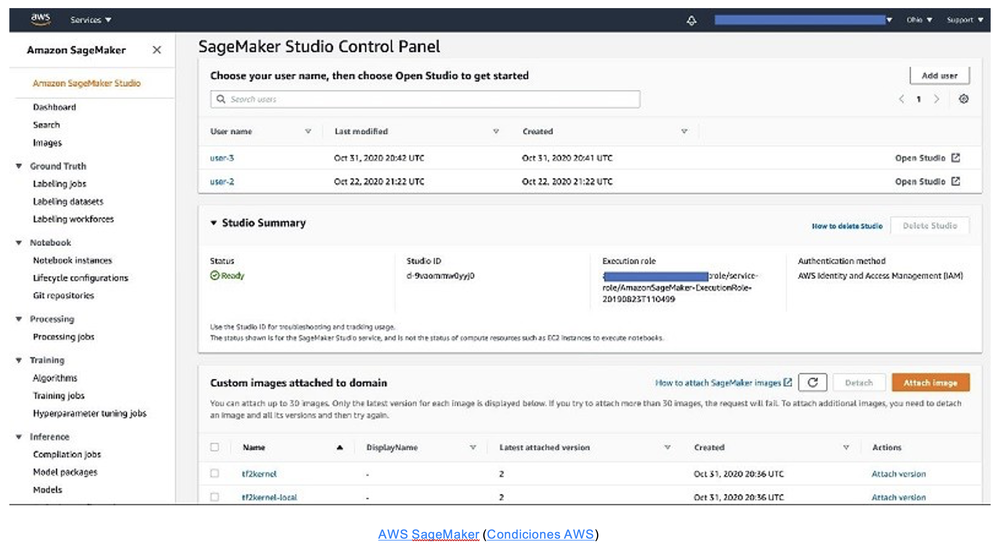
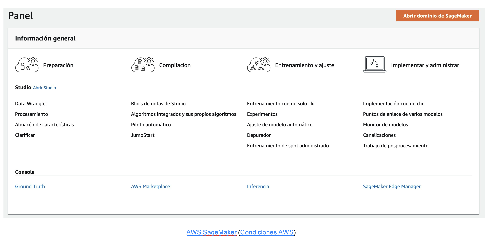
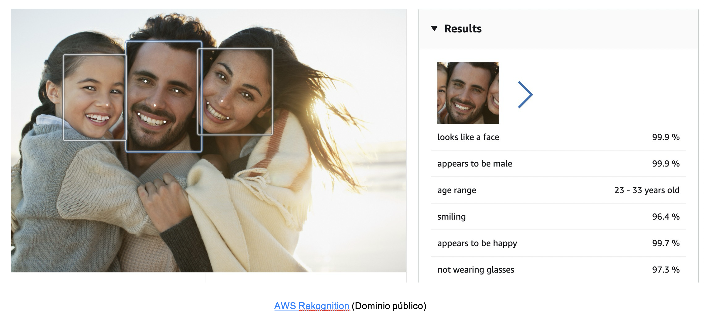
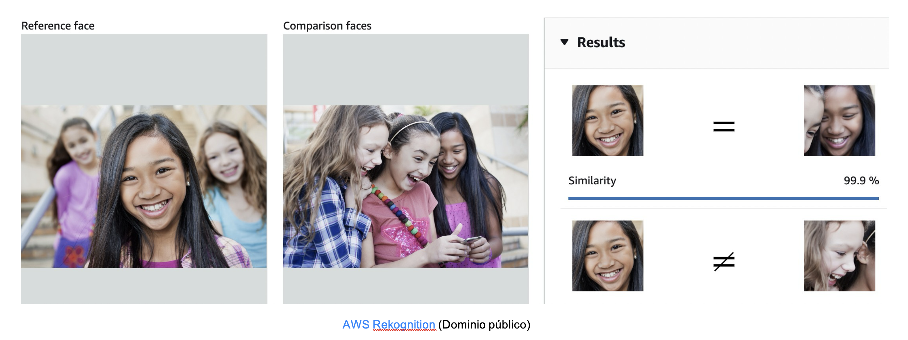
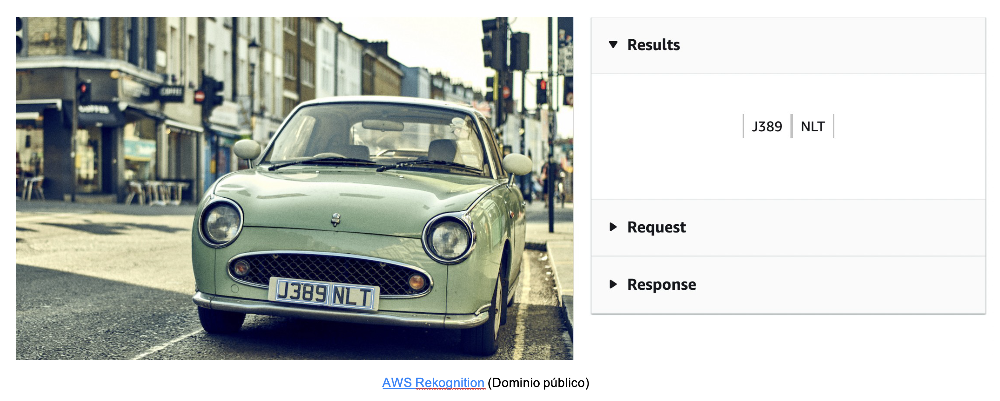

# Amazon Web Services
Esta plataforma fue lanzada oficialmente en 2006 a raíz de una propuesta de Chris Pinkham y Benjamin Back, que vieron una oportunidad de negocio en la utilización de recursos sobredimensionados en **Amazon.com**.

Cuenta con una colección de servicios para desarrolladores y organizaciones muy amplio, que permite que toda la lógica y gestión de negocio esté integrada en un mismo flujo de trabajo.

Se accede a través de HTTP, utilizando protocolos REST y SOAP. Fue una de las primeras ofertas de pago por uso en infraestructura que se dio en un momento de resurgimiento de propuestas en internet tras una burbuja de las .com y ese formato facilitó la entrada de muchas startups y proyectos que no hubiesen sido viables con los formatos tradicionales disponibles de host.

Uno de los servicios más valorados para proyectos emergentes y que necesitan escalabilidad, es la arquitectura sin servidor, utilizando las denominadas funciones **Lambda**, lanzadas en 2014.

En el ámbito de la inteligencia artificial, cuenta con un servicio administrado para la creación, entrenamiento y despliegue de modelos de aprendizaje automático denominado **SageMaker**

Ofrece servicios más concretos y enfocados en aplicaciones concretas de visión artificial, bots conversacionales y analítica avanzada. 

## SageMaker
Se encuentra dentro de las opciones que ofrece la plataforma AWS en el ámbito de la inteligencia artificial.
Es el entorno integrado para la creación, entrenamiento y despliegue de modelos de machine learning en AWS.
Contiene varios servicios que se gestionan a través de un panel de control, un IDE personalizado llamado **SageMaker Studio** y una interfaz de visualización y presentación llamada **Canva**. 
La mayoría del trabajo de un **MLops** se va a desarrollar dentro de **SageMaker Studio**, que ofrece la experiencia de programación en formato **notebook** con una serie de herramientas de apoyo extra y una funcionalidad muy interesante llamada **Autopilot**.

El panel de control desde el que se pueden lanzar y gestionar los proyectos, muestra todos los parámetros del mismo, como los usuarios que están colaborando o las políticas de acceso.

Para cada fase del proceso, hay una sección con los servicios más utilizados, donde se puede ir dando de alta y lanzando el dataset, arquitectura del modelo, modelo predictivo y despliegue.

Como hemos comentado previamente, SageMaker cuenta con una utilidad para automatizar la parte más técnica del proceso de creación y entrenamiento de un modelo de aprendizaje automático. **Autopilot** analiza el dataset y la morfología de los datos objetivo y automatiza la selección del tipo de modelo y parámetros asociados al entrenamiento. Pero este servicio tiene un coste mayor que el proyecto normal.

## Rekognition

Es el servicio de reconocimiento de imagen de AWS ya pre-entrenado y desplegado, que ya se puede probar a través de una interfaz demostrativa, y que se puede integrar en cualquier proyecto mediante llamadas a su API.

Un primer modo, de reconocimiento de "etiquetas" en una imagen, da como resultado los objetos que se podrían encontrar en dicha imagen.

El modo de moderación de imágenes, detecta el grado de probabilidad de que la imagen contenga contenido sensible que deba desenfocarse o que deba activar algún tipo de acción.

En el modo de reconocimiento facial, se reconocen con bastante precisión factores como rasgos masculinos o femeninos, si está sonriendo o demostrando alguna emoción concreta detectable, el rango de edad, etc.

Otro modo interesante, es la función de comparación facial, para identificar el rostro de determinadas personas dentro de otras imágenes.

Finalmente, también se puede reconocer la presencia de texto en una imagen, identificando letras y números o caracteres especiales, devolviendo la cadena de caracteres reconocida como salida de la función.

