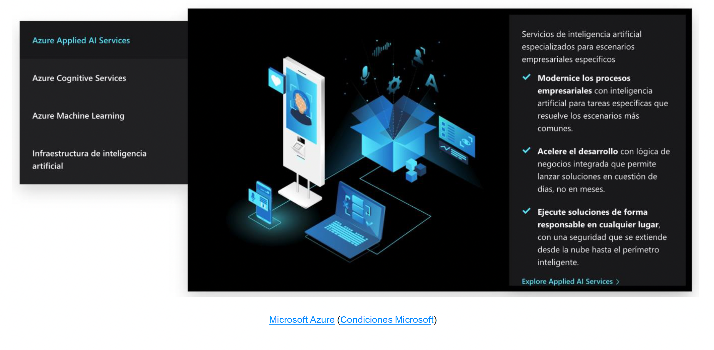
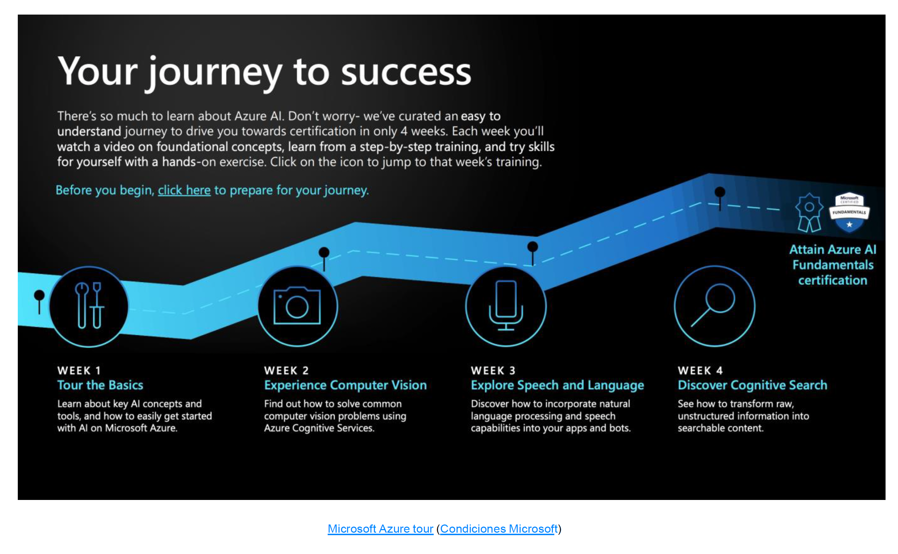

# Microsoft Azure
Microsoft, aunque era bien conocida por sus productos de ofimática para usuario final, sistema operativo Windows y algunos productos de software para empresas, ha desplegado también su plataforma de **cloud computing** conocida como **Azure**. Sus últimos esfuerzos por abrir comunidad y ofrecer servicios que puedan competir con otras nubes han dotado a Azure de algunas propuestas muy interesantes:
- Azure Applied AI Services
- Azure Cognitive Services
- Azure Machine Learning
- Infraestructura de inteligencia artificial

## Cognitive Services
Es la suite de modelos listos para usar de Microsoft. Funciona a través de llamada API e implementa servicios de reconocimiento de voz, texto, comprensión de lenguaje natural, reconocimiento de imagen y analítica avanzada de datos para toma de decisiones.
Permite utilizar, en un proyecto, funcionalidades de inteligencia artificial, sin necesidad de desarrollo concreto de machine learning.

