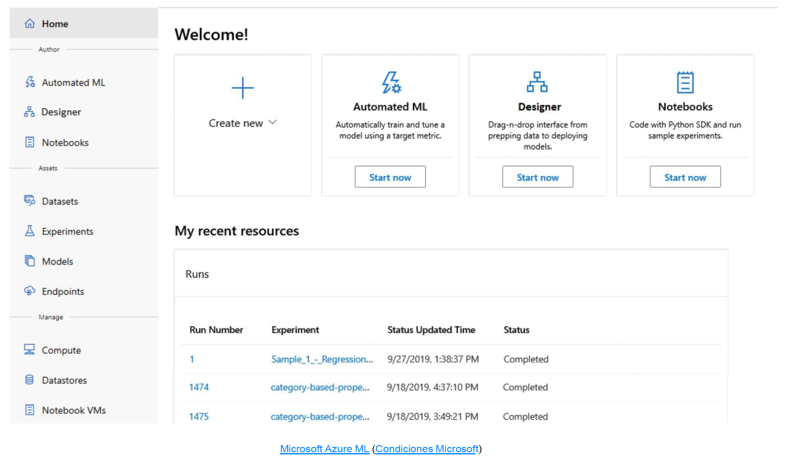
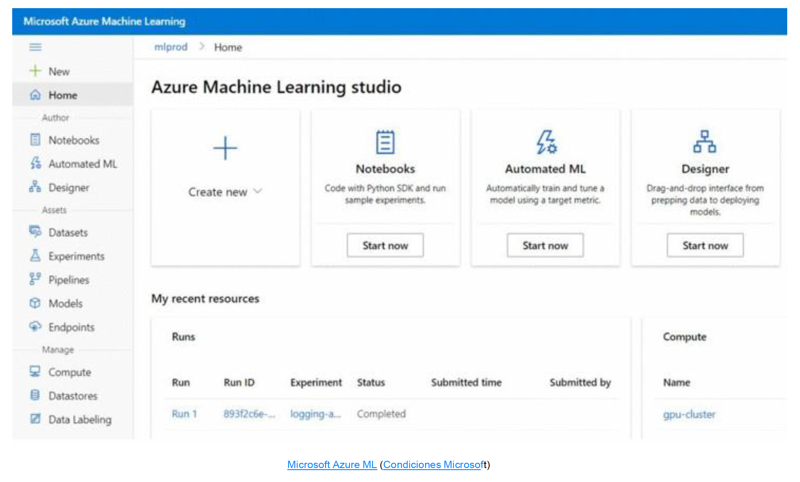

# Microsoft Azure
Microsoft, aunque era bien conocida por sus productos de ofimática para usuario final, sistema operativo Windows y algunos productos de software para empresas, ha desplegado también su plataforma de **cloud computing** conocida como **Azure**. Sus últimos esfuerzos por abrir comunidad y ofrecer servicios que puedan competir con otras nubes han dotado a Azure de algunas propuestas muy interesantes:
- Azure Applied AI Services
- Azure Cognitive Services
- Azure Machine Learning
- Infraestructura de inteligencia artificial

## Cognitive Services
Es la suite de modelos listos para usar de Microsoft. Funciona a través de llamada API e implementa servicios de reconocimiento de voz, texto, comprensión de lenguaje natural, reconocimiento de imagen y analítica avanzada de datos para toma de decisiones.
Permite utilizar, en un proyecto, funcionalidades de inteligencia artificial, sin necesidad de desarrollo concreto de machine learning.

## AzureML
Azure Machine Learning es el servicio para crear y entrenar modelos de cero, con la facilidad de conectarlos al resto de servicios necesarios en un proyecto de forma eficiente e integrada. Cuenta con un escritorio específico de trabajo, denominado Studio, en el que se puede iniciar y gestionar los modelos, sus implementaciones, métricas e historiales de ejecución.

La interfaz permite trabajar con cuadernos Jupyter Notebook, utilizar librerías para aprendizaje automático y la flexibilidad de configurar los hiperparámetros en el código. Cuenta con una herramienta de depurado y permite la integración con el entorno de programación Visual Studio Code, con lo que se integra con relativa facilidad en proyectos que ya están desplegados en la nube.

