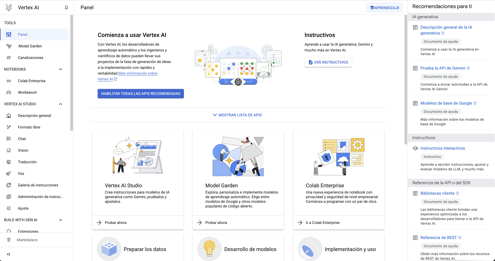

# Google Cloud Platform
GCP es uno de los principales proveedores de computación en la nube que utilizan las empresas y organizaciones. 

Para trabajar con GCP, es necesario registrarse y crear una cuenta con datos de facturación. La mayoría de servicios son gratuitos hasta un cierto volumen de utilización, y para usuarios nuevos hay ofertas y créditos de regalo para poder probar durante los primeros meses. 

La interfaz de trabajo se llama **Consola** y cuenta con una pantalla de inicio con tus proyectos recientes:

El ecosistema de aplicaciones de la nube de Google es inmenso y vamos a fijarnos en una pequeñísima parte relacionada con IA.

https://cloud.google.com/products/

## Vertex AI
Vertex AI reúne los servicios de Google Cloud que permiten crear modelos de aprendizaje automático con una interfaz con APIs únicas y unificadas. Se pueden utilizar modelos ya entrenados y listos para usar o se pueden entrenar modelos adaptados a la lógica de negocio concreta.
Para acceder a ellos, desde la pantalla inicial de la consola de GCP: `Todos los productos` -> `Inteligencia Artificial` -> `Vertex AI`

Al pinchar **Vertex AI**, se presenta de forma casi ordenada, las fases que se siguen en cualquier proceso de preparación y despligue de un modelo de aprendizaje automático. En cada apartado del proceso, será necesario fijar los parámetros propios del proyecto.

