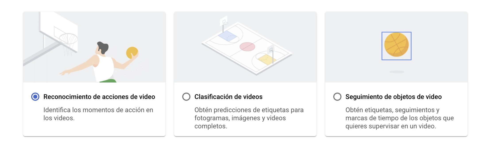

# Google Cloud Platform
GCP es uno de los principales proveedores de computación en la nube que utilizan las empresas y organizaciones. 

Para trabajar con GCP, es necesario registrarse y crear una cuenta con datos de facturación. La mayoría de servicios son gratuitos hasta un cierto volumen de utilización, y para usuarios nuevos hay ofertas y créditos de regalo para poder probar durante los primeros meses. 

La interfaz de trabajo se llama **Consola** y cuenta con una pantalla de inicio con tus proyectos recientes:


El ecosistema de aplicaciones de la nube de Google es inmenso y vamos a fijarnos en una pequeñísima parte relacionada con IA.

https://cloud.google.com/products/


## Vertex AI
Vertex AI reúne los servicios de Google Cloud que permiten crear modelos de aprendizaje automático con una interfaz con APIs únicas y unificadas. Se pueden utilizar modelos ya entrenados y listos para usar o se pueden entrenar modelos adaptados a la lógica de negocio concreta.
Para acceder a ellos, desde la pantalla inicial de la consola de GCP: `Todos los productos` -> `Inteligencia Artificial` -> `Vertex AI`


Al pinchar **Vertex AI**, se presenta de forma casi ordenada, las fases que se siguen en cualquier proceso de preparación y despligue de un modelo de aprendizaje automático. En cada apartado del proceso, será necesario fijar los parámetros propios del proyecto.


En la sección de **Conjunto de datos**, se seleccionan fuentes de datos desde **GoogleStorage**, **BigQuery** o por subida directa de un archivo csv desde nuestro local. una vez cargado uno o varios conjuntos de datos, se pueden analizar dichos datos y generar estadísticas para una exploración más completa.

```{warning}
Hace falta cuenta de facturación.
```

En la sección de **Entrenamiento**, se configuran parámetros, tipo de técnica a aplicar...

```{warning}
Para poder configurar bien el modelo, es neceasrio entender y conocer bien el tipo de problema en el que estamos trabajando. 
```
La naturaleza de los datos, si los casos están etiquetados o no en función de un campo objetivo para las predicciones, nos permitirá aplicar técnicas de aprendizaje automático supervisado, como la clasificación o la regresión.




Cuando el entrenamiento ya ha concluido, se pueden ver, en la sección **Modelo**, las métricas de desempleño conseguido.


Para poder probar e implementar el modelo, es necesario crear un **endpoint** o acceso al modelo en formato API REST. Esta tarea también la resuelve Vertex AI, prácticamente haciendo click en un botón. Tras tenerlo implementado, podemos hacer una prueba por valores, predicción por lotes y utilizar el **endpoint** en una aplicación.


## VisionAI

GCP cuenta con un producto de reconocimiento de imagen entrenado genérico que puede ser útil cuando no se cuenta con conjuntos de datos ni experiencia en creación y entrenamiento de modelos.
Este API ofrece:
- **Reconocimiento facial**
- **Reconocimiento de objetos de una imagen**
- **Identificación de etiquetas para una imagen**
- **Extracción de texto de una imagen**
- **Detección de elementos no seguros en imagen**: violencia, sexo, racismo...

En el caso de reconocimiento facial, el modelo detecta los elementos del rostro y según sus posiciones relativas ha sido entrenado para etiquetar respecto a las principales emoviones. También detecta la orientación del rostro en la imagen.


También se pueden reconocer objetos en una imagen a través de la detección de bordes y formas, ya que el modelo ha sido entrenado con una gran cantidad de imágenes etiquetadas que incluían objetos de todo tipo. 

```{note}
Si necesitásemos que se reconociesen en la imagen objetos peculiares o muy originales, tendríamos que entrenar nuestro propio modelo con imágenes bien etiquetadas que contuviesen dichos objetos
```


En muchas aplicaciones, especialmente si van a tener una calificación por edades que garantice un uso seguro por parte de menores, es necesario implementar filtros que bloqueen o adviertan de imágenes que contengan elementos o situaciones sensibles.


Una utilidad muy extendida para esta API es la de detección de texto en imagen. El modelo reconoce los trazos típicos de caracteres escritos y lo entrega por bloques. 

```{note}
El modelo sólo detecta que hay texto, después, sería necesario aplicar un modelo de procesamiento del lenguaje para clasificar la intención o significado de dichos textos y así poder clasificarlo para su uso posterior.
```


```{warning}
Cuando las funcionalidades de la API de Vision no son suficientes y es necesario entrenar modelos de aprendizaje automático para reconocimiento de imagen con parámetros concretos o detectar elementos muy concretos de un ámbito de actuación, es mejor recurrir a **AutoML Vision**, integrado o no, dentro de **Vertex AI**
```

