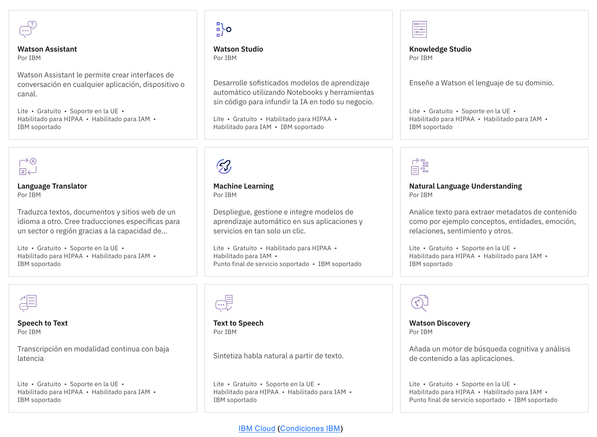
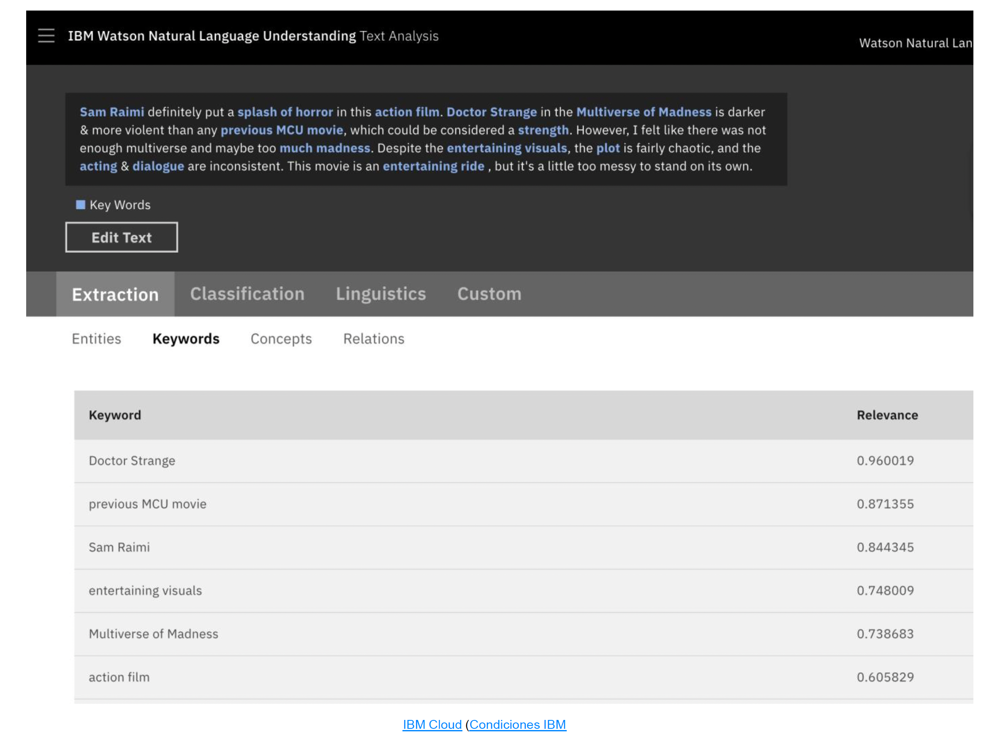
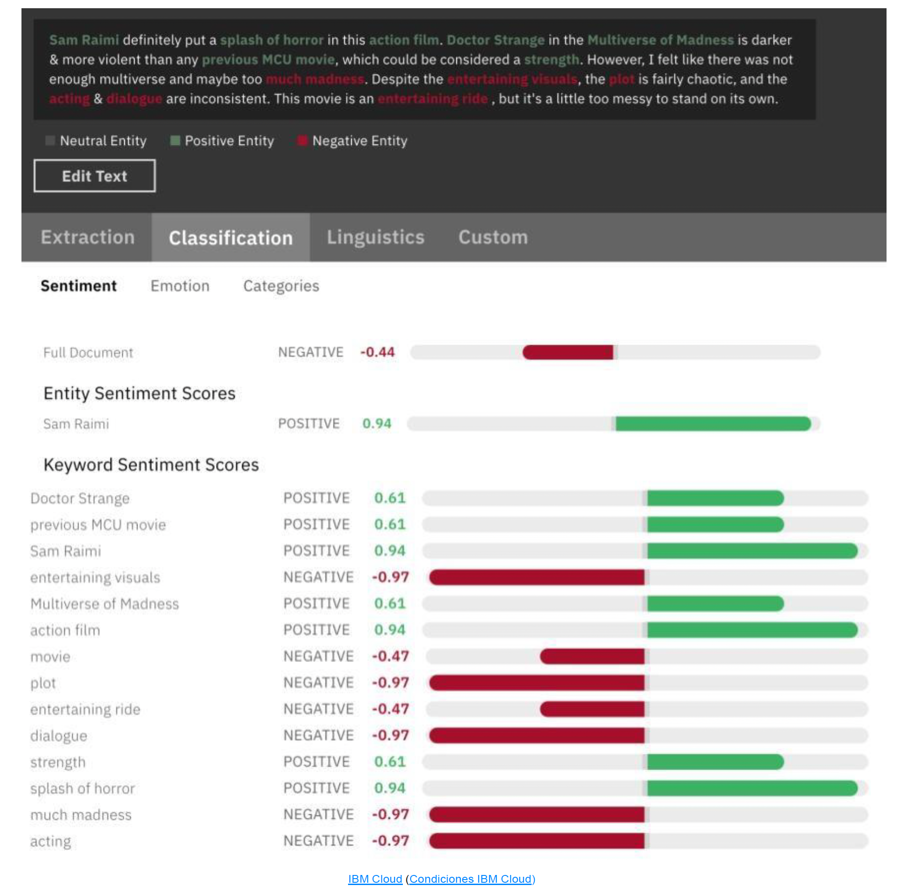
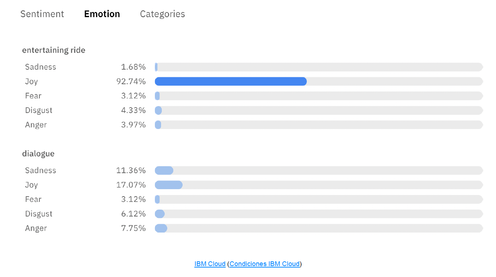
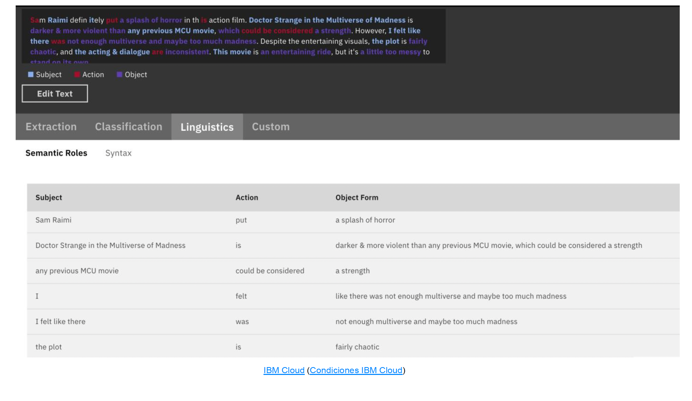

# IBM Cloud
La plataforma en la nube de IBM fue de las primeras en ofrecer servicio de inteligencia artificial como servicio, a través de su producto estrella **Watson**. Poco a poco han ido creando todo un catálogo de productos para diferentes usos y tipos de aplicaciones.

## Watson
Este servicio tiene varias herramientas disponibles, entre las que encontramos módulos pre-entrenados y listos para integrar, vía API en una aplicación o proyecto, así como entornos en los que trabajar con modelos de aprendizaje automático a bajo nivel.

La herramienta de trabajo básica de IBM para aprendizaje automático es Watson Studio. Facilita el desarrollo de un entorno gráfico al estilo **Node.js**, pero también permite utilizar un entorno tipo **Notebooks**.

**IBM Watson Natural Language Understanding**, en su extensión de análisis de texto, logra un resultado muy completo, tanto en la fase de extracción y clasificación de entidades y expresiones clave, como en la fase de interpretación de emociones para cada expresión clave.
Ejemplo: en la prueba con una valoración de un usuario que ha visto la película *Doctor Strange in the Multiverse of Madness*, vemos una extracción de las palabras clave muy acertada.

Si recurrimos a las funciones de análisis de sentimiento, obtenemos una evaluación con información muy completa en cuanto a qué palabras o expresiones clave han tenido mayor peso en categorizar este comentario como negativo.

También nos da información sobre el grado reflejado de las principales emociones asociadas a las palabras clave.

Por último, cabe destacar el análisis de las categorías semánticas de las distintas expresiones clave, que son una de las principales fuentes para la parametrización del texto.

