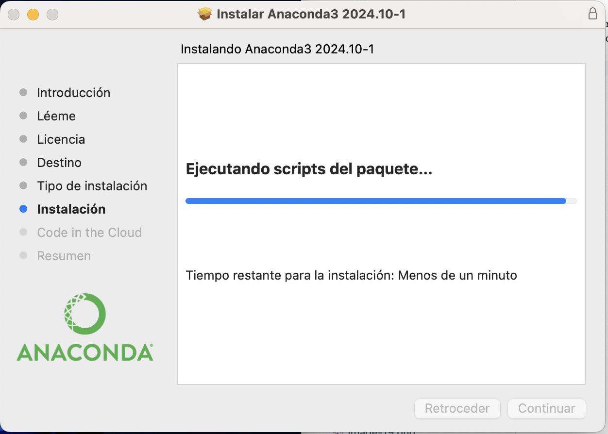
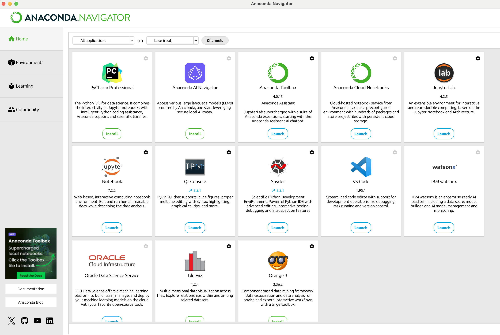

## Preparación entorno offline
Vamos a utilizar una distribución de Python y R para ciencia de datos que se llama **Anaconda**.

https://www.anaconda.com/download

**Anaconda** tiene las siguientes características:
- Incorpora varios paquetes relacionados con algoritmos de ML y preparación de datos.
- Incorpora herramientas para implementación en Python, como Jupyter Notebook.
- Creación y gestión de entornos virtuales.

