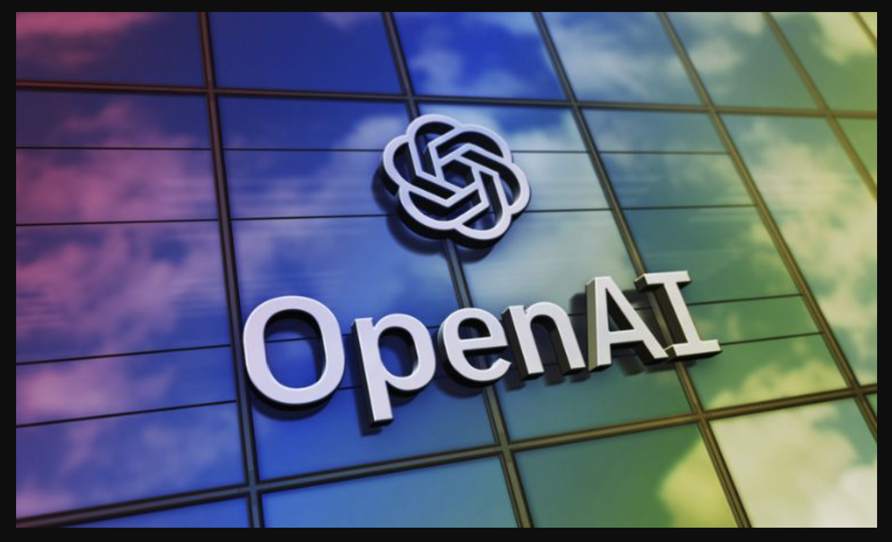
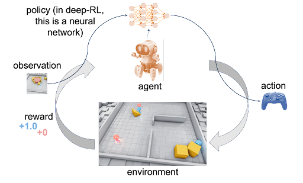
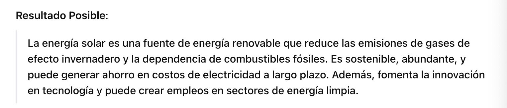

# OpenAI
Es una organización de investigación en IA fundada en 2015. Inicialmente OpenAI fue una organización sin ánimo de lucro, aunque con el tiempo eso cambió.

OpenAI es conocida principalmente por desarrollar modelos de lenguaje como **GPT** (Generative Pre-trained Transformer) y **DALL-E** para la generación de imágenes, así como **Codex** para la generación de código.

OpenAI ha desarrollado algunas de las tecnologías de IA más avanzadas disponibles hoy en día, siendo un líder en modelos de lenguaje grande (**LLMs**), generación de imágenes y aplicaciones de IA general.


## OpenAI Gym
Es una plataforma para aprender y experimentar con algoritmos de **aprendizaje por refuerzo (RL)**.
Su principal objetivo es proporcionar un entorno estándar donde investigadores, estudiantes y desarrolladores puedan probar y mejorar los algoritmos que entrenan a "agentes" (programas o robots virtuales) para que tomen decisiones en diversos tipos de escenarios.

```{note}
El RL es un tipo de aprendizaje automático donde un "agente" (como un robot o un personaje en un videojuego) aprende a tomar decisiones en un entorno específico, buscando obtener recompensas. La idea es que el agente pruebe diferentes acciones y aprenda cuáles se acercan más a sus objetivos, mejorando su desempeño con el tiempo.
Ejemplos:
- Entrenar a un robot para caminar o moverse sin caerse
- Entrenar a un personaje de un videojuego a ganar puntos evitando obstáculos
- Optimizar la gestión de inventarios en un almacén para reducir costos
```

**OpenAI Gym**  ha sido fundamental para el desarrollo de algoritmos de RL, ya que permite a los investigadores probar sus métodos en condiciones estandarizadas y reproducibles. La disponibilidad de un marco de referencia en entornos ayuda a comparar resultados y evaluar el progreso de los nuevos enfoques de RL de manera uniforme.



## GPT (Generative Pre-trained Transformer)
Es la serie de modelos de lenguaje de OpenAI que incluye versiones como **GPT-3 y GPT-4** y de manera más avanzada, modelos que incorporan capacidades de razonamiento y comprensión complejas.

Estos modelos están diseñados para entender y generar texto en lenguaje natural, lo que permite aplicaciones en chatbots, generación de contenido, asistencia en programación, traducción y más.

Como usos tenemos: servicios de asistencia al cliente, generación de contenido, herramientas de redacción...

Está disponible a través de la **API de OpenAI** y **Playground** (para pruebas de texto e iteraciones sin necesidad de programar)

## Codex
Un modelo derivado de GPT-3 especializado en la generación de código. Codex puede entender y escribir en múltiples lenguajes de programación: Python, JS, Ruby...
Es el modelo que potencia **GitHub Copilot**, permitiendo el autocompletado de código y generar funciones completas basadas en descripciones en lenguaje natural.

Como usos tenemos: generación automática de código, asistencia en la depuración, aprendizaje de programación y documentación automática.

Está disponible a través de la **API de OpenAI** y GitHub Copilot es una de sus implementaciones más conocidas.

## DALL-E
Es un modelo de generación de imágenes que convierte descripciones textuales en imágenes detalladas. DALL-E permite a los usuarios crear imágenes a partir de prompts detallados, haciendo posible el diseño visual sin necesidad de habilidades gráficas avanzadas.

Como usos tenemos: generación de contenido visual, diseño de productos, marketing y publicidad.

Está disponible a través de **DALL-E Playground** y la **API de OpenAI** para la integración en proyectos.

## Whisper
Es un sistema de reconocimiento de voz de alta precisión capaz de transcribir y traducir el habla en múltiples idiomas.
Se destaca su utilidad en situaciones de mucho ruido y en transcripción de dialectos, gracias a su capacidad de comprender varios acentos y entornos.

Como uso tenemos: transcripción de audio a texto, subtitulación automática, traducción de audio, asistencia para accesibilidad.

Está disponible a través de la **API de OpenAI** y también disponible como modelo open-source para implementaciones personalizadas.

## CLIP (Contrastive Language-Image Pretraining)
Es un modelo que entiende relaciones entre texto e imágenes. CLIP puede clasificar imágenes basándose en descripciones textuales y buscar correspondencias entre texto e imágenes sin entrenamiento específico para cada categoría.

Como uso tenemos: búsqueda visual, clasificación de imágenes, etiquetado automático de contenido visual, sistemas de recomendación basados en imágenes.

Está disponible en Github como código open-source, se usa en combinación con DALL-E para mejorar la calidad y relevancia de las imágenes generadas.

## OpenAI API

Es la API central de OpenAI, que permite a los desarrolladores acceder a los modelos de lenguaje de OpenAI, Codex, Whisper y otros desde sus aplicaciones y servicios.

Como uso tenemos: integración de capacidades de IA en productos y servicios personalizados desde chatbots y asistentes virtuales hasta herramientas de análisis de texto y generación de conteniodo.

Está disponible en la web de OpenAI, ofrece documentación detallada y un panel para gestionar el uso de los modelos.

### Ejemplo de código para hacer una llamada a la API
```py
import openai

# Configura tu clave API
openai.api_key = "TU_CLAVE_API"

# Realiza una solicitud a GPT-4 con un ejemplo de prompt
response = openai.Completion.create(
  model="gpt-4",
  prompt="¿Qué es el aprendizaje profundo y cómo se diferencia del aprendizaje automático?",
  max_tokens=100,
  temperature=0.7
)

# Imprime la respuesta generada por el modelo
print(response.choices[0].text.strip())
```

Un ejemplo de resultado para un prompt concreto sería:
```py
response = openai.Completion.create(
  model="gpt-4",
  prompt="Describe los beneficios de la energía solar.",
  max_tokens=100,
  temperature=0.5
)
print(response.choices[0].text.strip())
```


## OpenAI Playground

Es una interfaz interactiva en la que los usuarios pueden experimentar con los modelos de lenguaje de OpenAI. En Playground se pueden escribir y ajustar prompts y parámetros sin tener que programar.

Como uso principal podemos experimentar con prompts para ajustarlos antes de usarlos en aplicaciones, prototipos rápidos y exploración de capacidades del modelo.

Está disponible a través de la web en el sitio de OpenAI.

