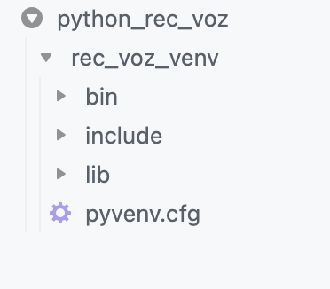
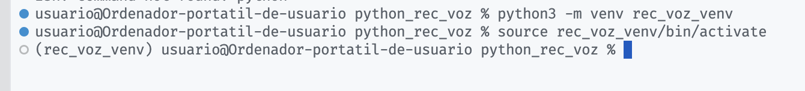
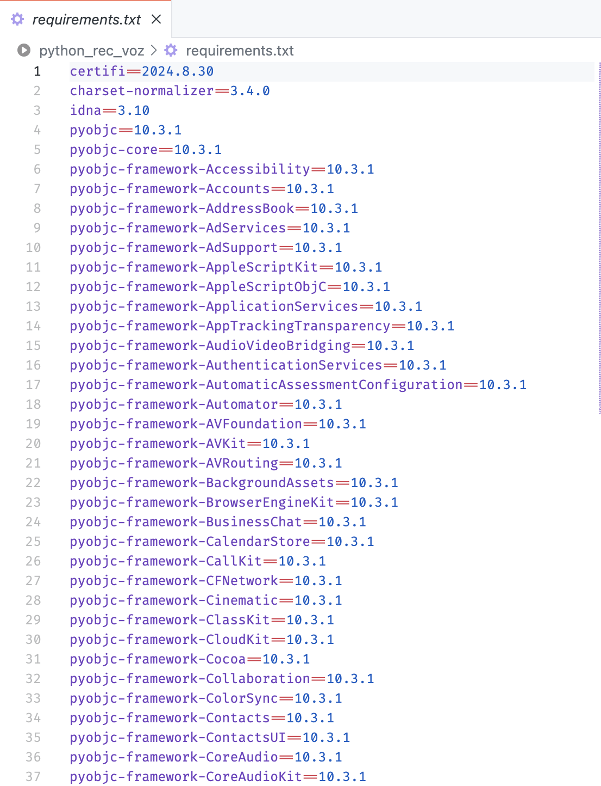

# Configurar un entorno virtual
Crear un entorno virtual es una buena práctica para aislar las dependencias de tu proyecto Python.
- Abrimos VS Code y seleccionamos la carpeta donde vamos a crear nuestro proyecto.
- Abrimos un terminal en VS Code **Terminal -> New Terminal**
- Ejecutamos los siguientes comandos para crear y activar un entorno virtual:

  ```bash
  python -m venv rec_voz_venv
  ```
Creamos un entorno virtual con el nombre `rec_voz_venv`



```bash
.\rec_voz_venv\Scripts\activate
```

En Windows, activamos el entorno virtual con este comando

```bash 
source rec_voz_venv/bin/activate
```

En Linux/MacOS activamos el entorno virtual con este comando

- Si todo ha ido bien, deberá aparecer el nombre del entorno entre paréntesis en el terminal `(rec_voz_venv)`



Cuando creamos un repositorio con Git, para almacenar nuestro proyecto en Python, no tiene sentido que se almacene toda la información de nuestro entorno virtual, por lo tanto tenemos que tener un fichero `.gitignore` preparado para que no se haga control de versiones de todos estos ficheros.

El contenido del fichero `.gitignore` debe ser similar a este:

```txt
# Ignorar el entorno virtual
venv/
env/

# Archivos compilados de Python
__pycache__/
*.py[cod]
*.pyo

# Archivos de logs
*.log

# Ignorar configuración de editores
.idea/
.vscode/

# Archivos de cobertura de código
htmlcov/
*.cover
*.coverage
*.coverage.*
.cache
nosetests.xml
coverage.xml
*.coveragerc

# Archivos específicos del sistema operativo
.DS_Store
Thumbs.db
```


Todo proyecto debe tener un archivo `requirements.txt` (o similar) en el raíz del proyecto con todas las dependencias del proyecto para poder reconstruirlo. Es responsabilidad del programador generar dicho fichero, se puede hacer con el comando:

 ```bash
  pip freeze > requirements.txt
  ```

  Esto genera un fichero de este tipo:



Si a partir de un fichero de este tipo quiero instalar todas las dependencias en mi entorno virtual para reconstruir mi proyecto, tendría que hacer:

 ```bash
  pip install -r requirements.txt
  ```
