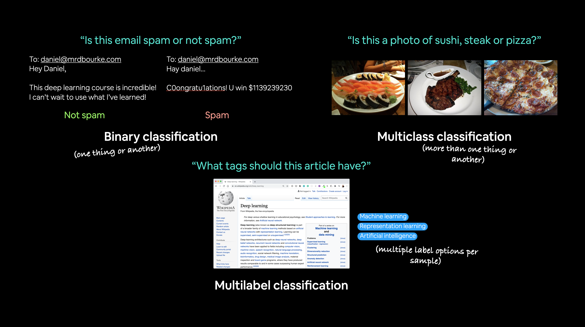
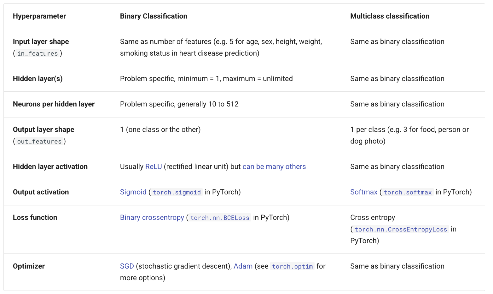
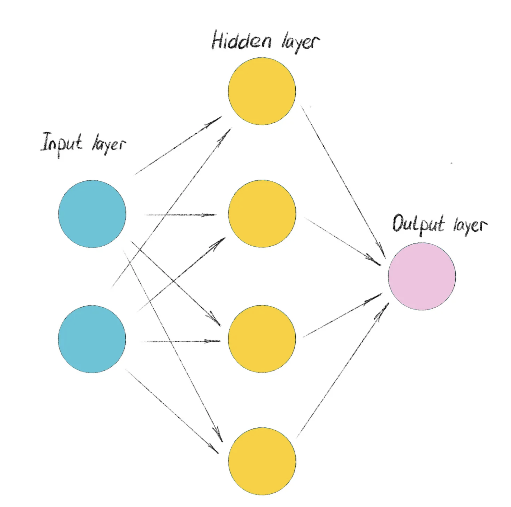

# Clasificación de redes neuronales en PyTorch

## Ejemplos de clasificación de problemas



**Multiclase**: asigna a cada imagen una etiqueta
**Multietiqueta**: asigna a cada elemento varias etiquetas

## Clasificación de entradas y salidas

Imaginemos que tenemos un conjunto de imágenes de entrada y una aplicación que queremos que identifique los tipos de alimentos que se encuentran en las imágenes.

Necesitamos representar numéricamente las imágenes, construir un algoritmo de ML y obtener unas salidas que posteriormente tendremos que convertir en información entendible por el ser humano.

Imaginemos que las imágenes se redimensionan a W=224, H=224 y C=3, es decir, 3 canales (R, G, B).

Las entradas serían tensores con esa información y las salidas serían probabilidades de que esa imagen tenga por ejemplo: sushi, meat o pizza.


La recomendación además es que indiquemos tamaño de tandas a procesar que sean múltiplo de 8, por ejemplo con 32 suele funcionar bastante bien.

Podemos tener una shape de entrada Shape = [32, 3, 224, 224] y una shape de salida Shape = [3] (Sushi, meat o pizza). Estos shapes dependerán del problema con el que estemos trabajando.

## Arquitectura de alto nivel de clasificación de una red neuronal

En una red neuronal hemos establecido que los parámetros de entrada serán numéricos y la salida serán probabilidades.





Cada nodo es una neurona, una caractertística (capas de entrada).
En los nodos de capas ocultas, PyTorch realizará algún tipo de operación.
Los nodos de salida, tendremos uno por cada clase.
**Hidden Layer Activation**: pueden ser muchos tipos, aunque típicamente es una unidad lineal rectificada (ReLU). De todos modos pyTorch tiene muchos tipos de activadores no lineales.
**Activación de salida**: puede ser una Sigmoide por ejemplo para clasificación binaria, una SoftMax para muilticlase.
**Loss function**: en clasificación binaria podemos utilizar una entropía cruzada binaria y en multiclase una entropía cruzada.
**Optimizador**: solemos utilizar SGC (Stochastic Gradient Descent)


```{note}
https://github.com/igijon/PyTorch_Fundamentos/tree/main
```

