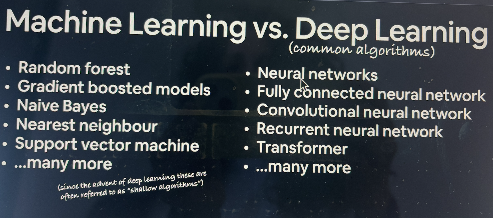
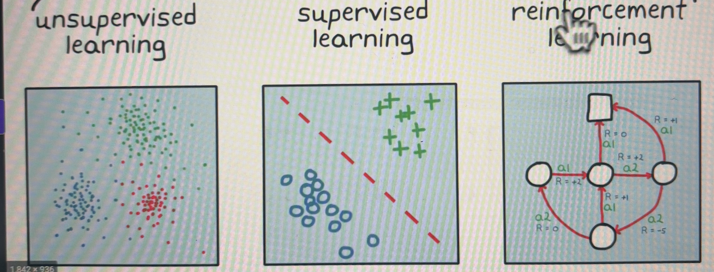

# Pytorch
PyTorch es un framework de python para aprendizaje automático.
Permite crear algoritmos de Deep Learning de última generación, como redes neuronales.
Lo utilizan empresas tecnológicas punteras como **Tesla** para crear los sistemas de visión por computador de sus coches autoconducidos. **Meta** también lo usa en sus sistemas. **Apple** para crear fotografía mejorada computacionalmente.

# Deep Learning

Deep Learning es un subconjunto de Machine Learning.
Machine Learning consiste en convertir en números los datos de las cosas, que pueden ser casi cualquier cosa: imágenes, texto, tablas de números, vídeo, archivos de audio... y después encontrar patrones de esos números.

Para datos estructurados solemos usar machine learning y para datos no estructurados solemos usar redes neuronales (deep learning.)

# Redes neuronales

Podemos tener distintos datos, de lo que sea, imágenes, texto, audio.., todos estos datos hay que convertirlos a números para que puedan ser usados por una red neuronal, a esto lo llamamos codificación numérica. Una vez convertidos a número, lo pasamos por una red neuronal (que normalmente tienen capas de entrada, capas ocultas y capas de salida) y finalmente tenemos un tipo de salida.
Veremos qué tipo de red neuronal utilizar en cada caso, por ejemplo para procesamiento de lenguaje natural (NLP) utilizaremos CNN (red neuronal convolucional)... pero todas tienen el mismo principio: entradas, manipulación y salidas.
La salida también será una representación  numérica que se traducirá luego a resultados comprensibles por el ser humano y veremos de qué manera se convierten.

# Anatomía de las redes neuronales

# Tipos de aprendizaje

- Aprendizeje supervisado: tenemos muchos datos, y las etiquetas.
- Aprendizeje no supervisdo y autosupervisado: no tiene etiquetas, sólo los datos de entrada. 
- Aprendizaje por transferencia: deep learning. Basicamente consiste en tomar los patrones que un modelo ha aprendido en un conjunto de datos y transferirlos a otro modelo. Si estoy intentando construir un algoritmo de aprendizaje supervisado para discernir entre fotos de gatos y perros, podríamos comenzar con un modelo que ya ha aprendido patrones de imágenes y transferir esos patrones fundacionales a nuestro modelo para que nuestro modelo tenga una ventaja.
- Aprendizaje por refuerzo: tenemos un entorno y un agente que realiza acciones en ese entorno y le damos recompensas y observaciones a ese agente. Ejm: quieres enseñar a tu perro a hacer sus necesidades fuera, nunca daríamos refuerzo si lo hace en el sofá.

# Para qué usamos Deep Learning

- Recomendaciones en Youtube, Spotify...
- Traducción, por ejemplo en Google 
- Reconocimiento de audio
- Visión por computador: detección coches en carretera, accidentes, reconocimiento facial...
- NLP: Procesamiento del lenguaje natural. Detección de si un email es spam o no, por ejemplo.
  

Los ejemplos de traducción y conversión de audio a texto se llaman **sequence to sequence (seq2seq)** porque reciben una secuencia y devuelven otra.

A los ejemplos que hemos comentado de visión por computador y NLP de SPAM o no SPAM les llamamos de regresión en el primer caso y clasificación en el segundo.

# Pytorch 

https://pytorch.org/

- PyTorch es un fw que permite con Python escribir rápidamente código de Deep Learning.
- Nos permite acceder a muchos modelos de DL preconstruidos de Torch Hub (torchvisiion.models).
- Permite trabajar con toda la pila: preprocesamiento de los datos, modelos, desplegado del modelo en tu aplicación/cloud.
- Fue desarrollado por Facebook (Meta) aunque ahora es OpenSource y lo usan Tesla (autopilot), OpenAI...

https://paperswithcode.com/trends

Permite control de forma óptima de la ejecución en GPU a través de una interfaz que se llama **CUDA toolkit**.
También se puede ejecutar tu código PyTorch en TPU que es una unidad de procesamiento tensorial, pero nos centraremos en GPU.
Las TPUs se llaman así porque usaremos constantemente tensores.

# Tensores

Tendremos una serie de entradas (en distintos formatos, tal vez) y necesitamos una serie de codificación numérica. A esta representación numérica se llama tensores.