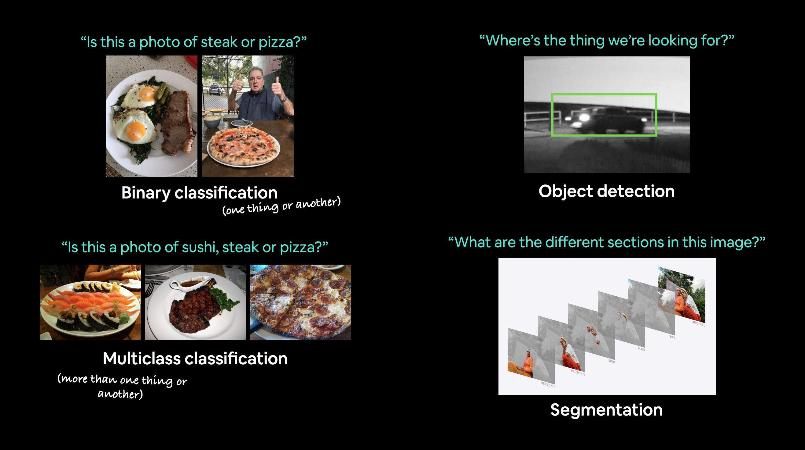

# Visión por computador y redes convolucionales

https://machinelearning.apple.com/

https://www.tesla.com/es_es/AI

## Representación de imágenes

https://es.wikipedia.org/wiki/Canal_(imagen_digital)#:~:text=Una%20imagen%20RGB%20tiene%20tres,ordenador%20y%20esc%C3%A1neres%20de%20imagen.

## Red neuronal convolucional