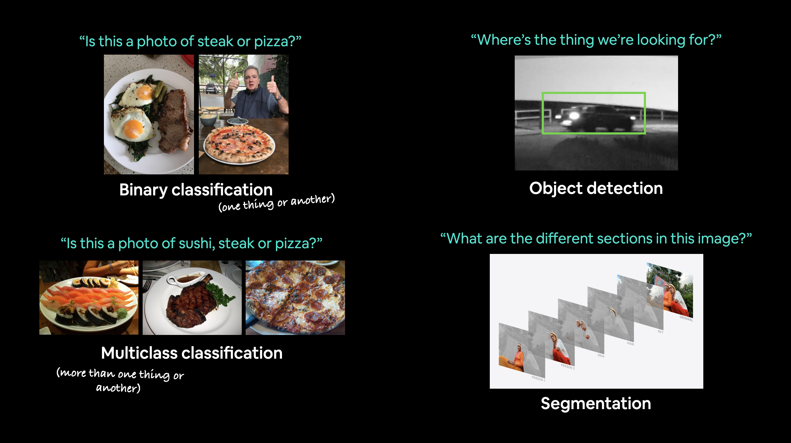
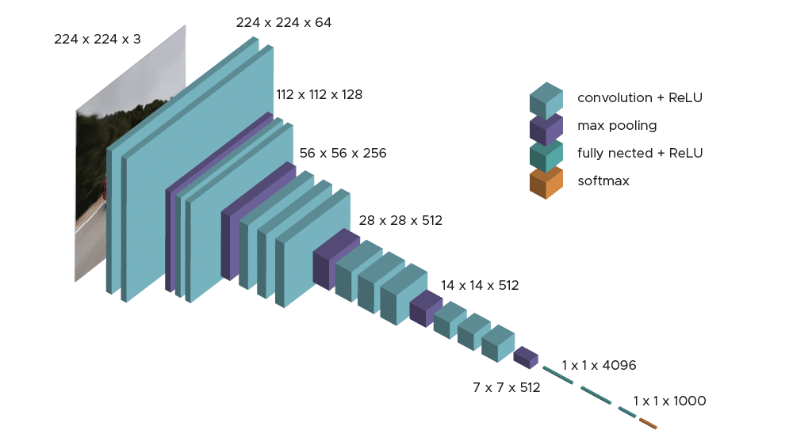

# Visión por computador y redes convolucionales



https://machinelearning.apple.com/

https://www.tesla.com/es_es/AI

## Representación de imágenes

https://es.wikipedia.org/wiki/Canal_(imagen_digital)#:~:text=Una%20imagen%20RGB%20tiene%20tres,ordenador%20y%20esc%C3%A1neres%20de%20imagen.

## Red neuronal convolucional

Tendremos una **capa de entrada**, que toma algunos canales y una forma de entrada. Es importante, como siempre alinear las formas de entrada y salida.
Tendremos una **capa convolucional** y en esta, se realizan operaciones matemáticas a través de una imagen o un tensor y se descubren patrones. `nn.Conv2d`



Los datos de entrada en cada capa de la red neuronal se someten a algún tipo de operación. Esas operaciones se van suceciendo en cada capa hasta convertirse en un resultado utilizable.

También, en la arquitectura de este tipo de redes, tenemos una activación oculta no lineal porque nuestros datos no son lineales.

Después tendremos una capa de salida lineal, en este punto se convierte la salida en la capa lineal que necesitamos, es decir podríamos convertir la salida en las clases que necesitamos.


```{note}
https://github.com/igijon/PyTorch_Fundamentos/tree/main
```